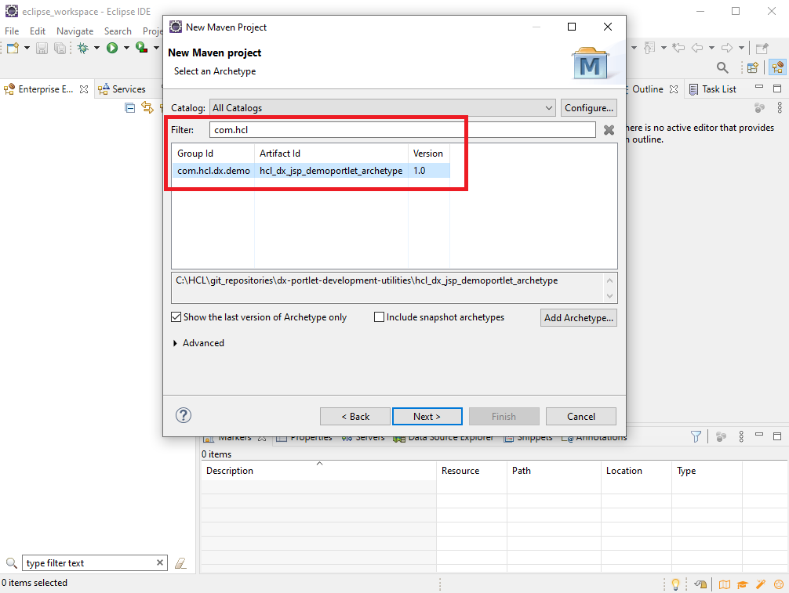

# Portlet Development Utilities for HCL Digital Experience

This repository contains custom Maven archetypes to create new JSP or JSF JSR286 portlets in IDEs, like Visual Studio Code or Eclipse more easily, by using the Maven Build Lifecycle. The repository is available under the Apache License V2.0.  

A Maven Archetype is a Maven project templating toolkit. An archetype is defined as an original pattern or model from which all other things of the same kind are made. Archetype will help authors create Maven project templates for users, and provides users with the means to generate parameterized versions of those project templates. For details, please check: [Introduction to Archetypes](https://maven.apache.org/guides/introduction/introduction-to-archetypes.html). Using archetypes provides a great way to enable developers work quickly in a way consistent with best practices employed by your project or organization.  

Maven Archetypes can be easily used within IDEs like Visual Studio Code, Eclipse or IBM Rational Application Developer to build up portlet sceletons and their Build Lifecycles (clean, validate, compile, test, package, verify, install etc.) very quickly.  

## Sample Screenshots

**Visual Studio Code**  

**Eclipse**  

**IBM Rational Application Developer**  

## Maven Archetypes

[Custom Maven archetype to create a new generic JSR286 portlet for DX](./hcl_dx_jsp_demoportlet_generic_archetype)  
[Extended custom Maven archetype to create a new JSR286 JSP portlet for DX with dxclient deployment and Visual Studio extensions](./hcl_dx_jsp_demoportlet_archetype)  
[Extended custom Maven archetype to create a new JSR286 JSF portlet for DX with dxclient deployment and Visual Studio extensions](./hcl_dx_jsf_demoportlet_archetype)  

## Java page creation utility

[A Java utiltiy (source-code sample) with corresponding Java Portlet that allows to create pages via the DX Java SPI's and API's](./page_creation_utility)  

## Product Documentation - Help Center

[Developing portlets](https://opensource.hcltechsw.com/digital-experience/latest/extend_dx/portlets_development)

[Application Programming Interfaces (APIs)](https://opensource.hcltechsw.com/digital-experience/latest/extend_dx/apis/)

## HCLSoftware U - Free Education

Learn more details on these utilities on HCLSoftware U learning materials. Use the lessons **Introduction** and **Java Portlet Development** from:

[HCL Digital Experience for Developers Advanced Course](https://hclsoftwareu.hcltechsw.com/courses/course/hdx-dev-300-dx-developer-advanced)  

## Support

In case of questions or issues please raise via Issues tab in this github repository. HCL Support will make every reasonable effort to assist in problem resolution of any issues found in this software.
