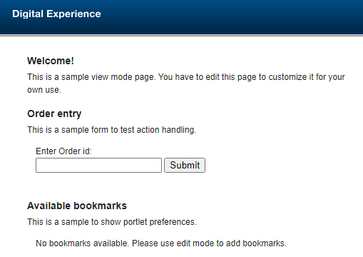

# DX JSP Portlet Archetype

This is a custom Archetype which is based on [Maven Portlet Archetype](https://maven.apache.org/archetypes/maven-archetype-portlet/) and can be used for creating HCL Digital Experience (DX) - Java Server Pages (JSP) based - Demo Portlets. When using this archetype with Microsoft Visual Studio Code IDE, sample scripts for deployment, update and undeployment are provided with a sample JSP portlet. It is possible to use this with other IDEs as well. In that case, the .vscode folder can be ignored.  

With this custom archetype it is possible to generate easily a ready to use HCL DX JSP Demo portlet with a corresponding development lifecycle:  

## Typical Development Lifecycle

1) [DX JSP Portlet Generation](#create-an-hcl-dx-jsp-demo-portlet-sample-project) (Source-code generation using this archetype)  
2) [WAR-File Generation](#build-the-war-file-deployment-artifact) (Building the deployment artifact)  
3) [Portlet Deployment](#deployupdate-or-undeploy-the-portlet-using-dxclient-optional) (Creates a sample XMLAccess file needed to deploy or update the portlet on a DX server, using DXClient. When using Microsoft Visual Studio Code, sample tasks are available to deploy and update the portlet on a local HCL DX server. This may be updated to work with remote HCL DX servers as well)  
4) [Optional Test it](#test-the-generated-portlet-optional) (Adding the demo portlet manually to a page)  
5) [Portlet Undeployment](#deployupdate-or-undeploy-the-portlet-using-dxclient-optional) (Create a sample XMLAccess file needed to undeploy the Portlet from a DX server using DXClient. When using Microsoft Visual Studio Code, a sample task is available to undeploy the portlet on a local HCL DX server. This may be updated to work with remote HCL DX servers as well)

## Prerequistes

### Prerequistes to build and install the archetype

* Maven needs to be installed ([Download link](https://maven.apache.org/download.cgi))  

### Prerequistes to create an HCL DX JSP Demo Portlet

* Maven needs to be installed ([Download link](https://maven.apache.org/download.cgi))  
* Java 1.8 needs to be installed. At best an IBM SDK that is shipped with the IBM Websphere Application Server. For details, please check: [System Requirements](https://support.hcltechsw.com/csm?id=kb_article&sysparm_article=KB0090156)  
* This archetype needs to be installed in Maven  

### Prerequistes to use an HCL DX JSP Demo Portlet with Visual Studio Code

* In addition to the previous prerequisites, have the Java and Maven extensions installed. Use of this and links to downloads are detailed in [Java build tools in VS Code](https://code.visualstudio.com/docs/java/java-build).  

### Prerequistes to deploy a sample HCL DX JSP Demo Portlet

* When creating a new project based on this archetype, sample scripts will be created which are prepared to run with a local HCL DX server. If you want to deploy the sample WAR-file using the generated scripts, a HCL Digital Experience Server need to be running locally. If you want to deploy the WAR file on a remote DX server, the /.vscode/tasks.json script need to be changed and the config.json file of the DXClient tool need to be changed to point to this remote server. Change the hostname and dxPort, and possibly other arguments to match your server.  

* HCL DXClient needs to be installed on the local system and the configuration settings need to pointing to a local HCL DX server instance. For details please check [DXClient](https://help.hcl-software.com/digital-experience/9.5/latest/extend_dx/development_tools/dxclient/).

## Install the DX archetype

Follow the commands in the below order to install the archetype.  

1) After downloading the dx-portlet-development-utilities git repository, go into the hcl_dx_jsp_demoportlet_archetype folder.  
2) Run ```mvn clean install``` to install the archetype JAR.  

## Create an HCL DX JSP Demo Portlet sample project

Once the new archetype is installed, create a new HCL JSP Demo Portlet using the following command:  

```mvn org.apache.maven.plugins:maven-archetype-plugin:3.1.2:generate -DarchetypeArtifactId="hcl_dx_jsp_demoportlet_archetype" -DarchetypeGroupId="com.hcl.dx.demo" -DarchetypeVersion="1.0" -DgroupId="com.hcl.dx" -DartifactId="jspdemoportlet"```

The parameters "-DarchetypeArtifactId", "DarchetypeGroupId" and "-DarchetypeVersion" values match the values of the provided archetype. Do not change these to create new DX JSP Portlets.  
For details, please check [Introduction to archetypes - What is Archetype?](https://maven.apache.org/guides/introduction/introduction-to-archetypes.html)  
You may want to change the "-DgroupId" and/or "-DartifactId" parameter values for your needs. For example, if you want to generate the portlet under your groupID (package-ID), just change the "-DgroupId" for example to "com.myorg.myportletpackage". You can also change the portlet name using "-DartifactId".  

## Build the WAR-File (Deployment artifact)

1) Go into the project directory.  
2) Run  ```mvn clean package``` to generate the HCL DX JSP Demo Portlet WAR file. It generates a WAR-file name that uses the artifactId and version in the folllowing format "(artifactID)-(archetypeVersion).war".  
   For this example, your WAR file is created under your project folder and will look like:  
   ```/<project-folder>/target/jspdemoportlet-1.0.war```

## Deploy/Update or Undeploy the Portlet using DXClient (Optional)

A new portlet project generated from this custom archetype includes sample XMLAccess files to deploy, update and undeploy the HCL DX JSP Demo Portlet on a local HCL-DX server. When using Microsoft Visual Studio Code IDE you have tasks to deploy and update (both use deploy_OR_Update_Portlet), and undeploy (undeploy_Portlet). For details, check file ```./vscode/tasks.json```. If any other IDE is used, the whole /.vscode folder can be ignored and/or deleted.  

Use the following DXClient command for a manual deployment or update of the portlet:  

```dxclient deploy-portlet -hostname <hostname> -dxPort <port> -dxConnectUsername <user> -dxConnectPassword <password> -dxUsername <user> -dxPassword <password> -warFile <workspaceFolder>/target/jspdemoportlet-1.0.war  -xmlFile <workspaceFolder>/scripts/DeployPortlet.xml```  

Use the following DXClient command for a manual undeployment of the portlet:  

```dxclient undeploy-portlet -hostname <hostname> -dxPort <port> -dxConnectUsername <user> -dxConnectPassword <password> -dxUsername <user> -dxPassword <password> -xmlFile <workspaceFolder>/scripts/UndeployPortlet.xml```  

## Test the generated Portlet (Optional)

As soon as the HCL DX JSP Demo Portlet is deployed, following these steps to test the portlet:  

1) Create a new empty page or use an existing one on your HCL DX Server. Ensure that the permissions are set correctly using the Practitioner Studio - Administration - Manage Pages.  
See details in [Assigning access to pages, labels, and URLs](https://help.hcl-software.com/digital-experience/9.5/latest/deployment/manage/portal_admin_tools/portal_user_interface/managing_pages/h_mp_access/).  
2) Add the portlet to the page. Ensure that the portlet permissions are set correctly using the Practitioner Studio - Administration - Applications - Portlets.  
See details in [Assigning access to a portlet](https://help.hcl-software.com/digital-experience/9.5/latest/extend_dx/portlets_development/mng_portlets_apps_widgets/portlet_management/h_mport_access_portlets/).  
3) Open the page and test the portlet.  

## Sample Screenshots

### Portlet View

    
  
### Portlet View with value

    

### Edit Mode - Menu

    
  
### Add a Bookmark

    

### Portlet View - Bookmark added

    
