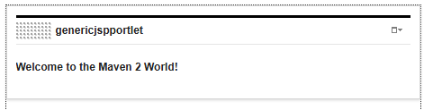
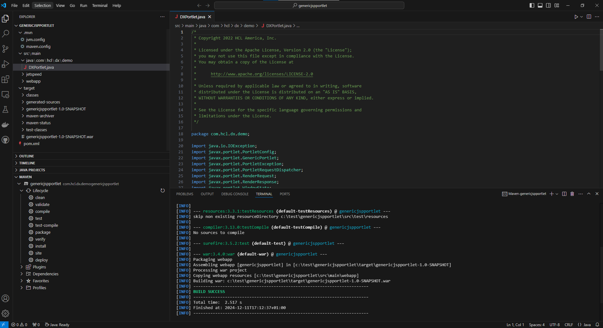

# DX Portlet Archetype

This is a Custom Archetype which is based on [Maven Portlet Archetype](https://maven.apache.org/archetypes/maven-archetype-portlet/) and is used for creating DX Portlet.

## Build DX archetype and generate the Portlet war file

Follow the commands in the below order to generate the Portlet war file.

- Run ```mvn clean install``` to generate the archetype jar.
- Create a new directory and go into it. (/my_new_war)
- Reference the command below for generating DX archetype.  

   ``` cmd
   mvn archetype:generate -DgroupId=com.hcl.dx.demo -DartifactId=hcl_dx_jsp_demoportlet_generic_archetype -Dversion=1.0-SNAPSHOT -DarchetypeGroupId=com.hcl.dx.demo -DarchetypeArtifactId=dxarchetype -DarchetypeVersion=1.0-SNAPSHOT
   ```

- Once the archetype is successfully build, go into the subdirectory that matches the ArtifactoryID that was used. Run  ```mvn clean package``` to generate the DX Portlet war file. This will generate war file for you to install. You can find the war file under a path similar to this: ```/my_new_war_root/{ArtifactoryID}/target```.

## Update DX with new generated portlet

Once the war file is generated successfully, follow the below scenario to test it.

- Login to the portal
- Navigate to Administration -> Applications -> Web Modules
- Choose the generated portlet war file to install.

Apply the generated portlet to either a new page or an existing page.

## Screenshots

### A sample Portlet created from that archetype



### Sample Project in Microsoft Visual Studio Code

  
