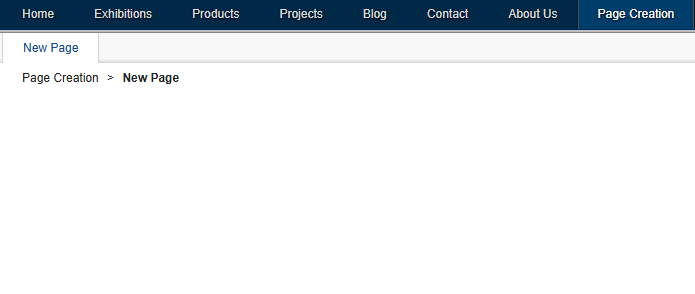
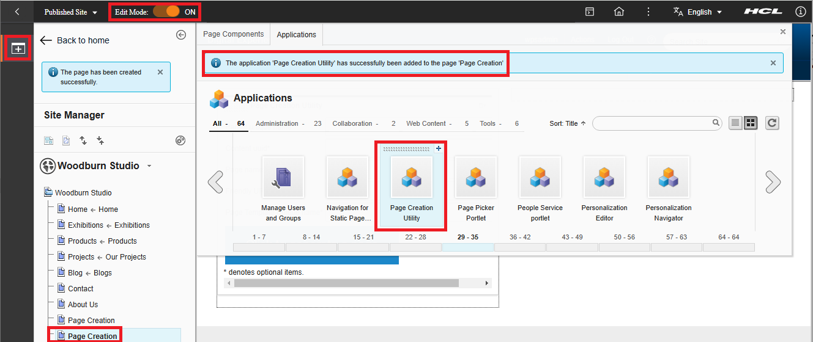

# Page Creation

This project contains a Java utility to create a single page using a default template or by selecting an existing page template. The project gives example source code that shows how to use the Controller and Model SPI calls related to WCM, for which the API calls will be handled inside of a JSP JSR286 portlet that provides the graphical user interface.  

It requires the parent page unique name under which the new page needs to be created. You may find the unique name under the Manage Pages portlets, e.g. shown here for parentPage.
You need to provide the page name and friendly URL for your new page, and then there are two samples, explained here.

## Utility Features

### Create new page with Web Content Viewer configured to a content sample

If you provide the Content UUID, it will create a page based on the default page template which has a Web Content Viewer portlet deployed. It will set this portlet with your content you provided.
Follow these steps to try this.

1. Find out a valid content UUID in your environment.  
    a) In the Practitioner Studio navigate to **Web Content > WebContent Composer > Web Content > Content > Articles > Sample Article**  
    b) Copy the UUID value  
      

2. Enter this in the **Content uuid** field and keep the **Page Template Unique name** empty. It may look like  

      
  
3. Click the **Click to generate a page** button.  

4. You should get the message **Successfully created \<Page name\>**, as shown:  

      

5. Refresh the page and you notice your **new page** added under the **parent page**.  

    

### Create new page based on a page template sample

The other sample allows you to create a new page under an existing parent page, based on a page template.  
Follow these steps to try this.

1. Find the **Page Template Unique name** you want to create your page from. You will find this under the Practitioner Studio - Administration - Manage Pages - Hidden Pages - Page Templates. Use the **Unique name or identifier** of the page template you want to use, e.g. wps.content.template.default for the Basic page template.

    

2. Enter this in the **Page Template Unique name** field. It may look like

      
  
3. Click the **Click to generate a page** button.  

4. You should get the message **Successfully created \<Page name\>**, as shown:  

      

5. Refresh the page and you notice your **new page** added under the **parent page**.  

    

## Building the application

You may use your favorite IDE to build the applicaton. It has **Maven** setup to simplify building it. Use the Maven **package** option to generate the DX portlet WAR file, when using the Maven-Plugin in your IDE, here shown for Microsoft Visual Studio Code:


or by using the command line tool by entering the command:  ```mvn package``` from the main-directory.

You will find the war file in the **target** directory.

## Deploying the application

There are two options available to deploy this application. Using the dxclient tool or by manual deploy the application in the portal administration page.  

### DXClient Deployment

You may want to use the **DXClient** to deploy this sample portlet. This repository already contain a ready-to-use [DeployPortlet.xml](https://help.hcl-software.com/digital-experience/9.5/latest/deployment/manage/portal_admin_tools/xml_config_interface/working_xml_config_interface/using_xml_config_cmd_line/adxmltsk_creat_mod_resrcs/?h=creating+modifying+resources+and) file in the deploy folder that contain all xml required information for the DX-environment to deploy the portlet. Please use the following steps to deploy the portlet with the dx-client tool:  

1. copy the war file from the **target** directory to the **deploy** folder.

2. execute the following command:  

    ```dxclient deploy-portlet -hostname <dx_hostname> -dxPort <dx_port> -dxProtocol https -dxConnectUsername <dx_connect_user> -dxConnectPassword <dx_connect_user_password> -dxUsername <dx_user> -dxPassword <dx_user_password> -warFile pageimport-1.0-SNAPSHOT.war -xmlFile DeployPortlet.xml```

    By using your own settings for:
    - dx_hostname
    - dx_port
    - dx_dx_connect_user
    - dx_connect_user_password
    - dx_user
    - dx_user_password

    The following output indicate a successful installation:  
     ```<status element="all" result="ok"/>```

    For example:
    

### Manual Deployment

You may want to deploy the sample portlet manually. For that, please login to the portal administration page (https://<DX_host>:<DX_port>/wps/myportal) as an **adminsitrator**. Then navigate to **Practitioner Studio > Administration > Applications > Web Modules > Install**. Select your generated portlet war file to install and click the **Finish** button. This installs your portlet as an application.

Install new web module:


Select the default settings:


After installation the new web module **pageimport-1.0-SNAPSHOT.war** should be listed as following:


### Add the Portlet to a page

As soon as the portlet is deployed, you can add it either by creating a new page or by using an existing page. Switch your page into the **Edit Mode**, click **Add page components** and **applications - Applications**. Then search for **Page import portlet** and add this to your page.  

Here an screenshot as an example, when the portlet will be added on a new sibbling page called **Page Creation** under **Woodburn Studio**:


**Result**  


## Related Documents

To learn how to develop Java Portlets, you may use [Help Center Portlet Development](https://help.hcl-software.com/digital-experience/9.5/latest/extend_dx/portlets_development/).
For details on APIs used in the utility.java, refer to the following links: [Controller SPI](https://help.hcl-software.com/digital-experience/9.5/latest/extend_dx/apis/controller_spi/) and [Model SPI](https://help.hcl-software.com/digital-experience/9.5/latest/extend_dx/apis/model_spi/).  
