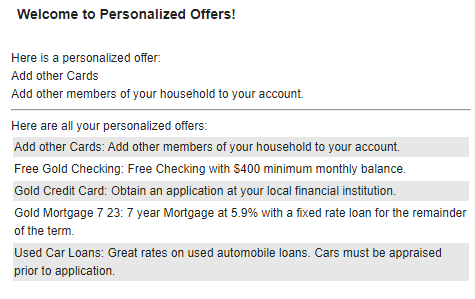

# Personalization Example (Pers_Offers)

A personalization portlet is a portlet that can show up specific information to a user based on rules. For details, please check: [Personalization](https://opensource.hcltechsw.com/digital-experience/latest/get_started/product_overview/personalization/?h=personalization)

This sample project is to learn how you may use the Personalization API to fully personalize the experience of your users. It will work with four different users (scott, andy, marge and tawana) and a pre-configured backend database (pzndemo_db). The sample uses a JSP Portlet to show up personalized offers from a database to a specific user that is currently logged in into the HCL Digital Experience server.  

As soon as the pzndemo is installed and configured, it is required to import the personalization rules into the HCL Digital Experience server. That can be found in the rules folder of this project. Detailed instructions to import those rules can be found in the Help Center under topic [Develop a Personalization Portlet](https://opensource.hcltechsw.com/digital-experience/latest/manage_content/pzn/pzn_portlet). As soon as this is done, the Pers Offers Portlet can be compiled/packaged and installed on the Portal server to show up personalized information to each of that four users as soon as the specific user is logged in.  

## Sample screenshot of the Pers Offers Portlet, when logged in as user Scott  

  

This repository contains the Pers_Offers personalization example code that can be reviewed/compiled/packaged and installed with Microsoft Visual Studio Code (VSC). The VSC project already contains required scripts (dxclient scripts) to install the Pers_Offers JSP Portlet on HCL Digital Experience (see scripts folder and tasks.json file).

This Maven code is based on the detailed instructions mentioned on the HCL Digital Experience Help Center page [Develop a Personalization Portlet](https://opensource.hcltechsw.com/digital-experience/latest/manage_content/pzn/pzn_portlet) and the intention of this project is to show up the usage of the HCL Digital Experience personalization API.

## Prerequisites

This Maven project is created on a Microsoft Windows environment on which the pzndemo_db default location is set to:

 **PZN-Database default location:** C:\HCL\wp_profile\PortalServer\derby\pzndemo_db

Code changes in the hrf-files might be needed when the pzndemo_db will be installed on a different location.

In addition to that two ConfigEngine tasks need to be executed on the HCL Digital Experience server to run this sample correctly.

**UNIX™Linux™:**  
```./ConfigEngine.sh create-pzndemo-users -DPortalAdminPwd=<password> -DWasPassword=<password>```  
```./ConfigEngine.sh install-pzndemo -DPortalAdminPwd=<password> -DWasPassword=<password>```  

**Microsoft Windows™:**  
```ConfigEngine.bat create-pzndemo-users -DPortalAdminPwd=<password> -DWasPassword=<password>```  
```ConfigEngine.bat install-pzndemo -DPortalAdminPwd=<password> -DWasPassword=<password>```  

This two tasks will generate the demo-users and the pzndemo_db database that will be used in this sample Portlet. For details, please check:

[Develop a Personalization Portlet](https://opensource.hcltechsw.com/digital-experience/latest/manage_content/pzn/pzn_portlet)  
[Install the Personalization sample](https://opensource.hcltechsw.com/digital-experience/CF221/manage_content/pzn/pzn_portlet/pzn_demoinstall/)  
